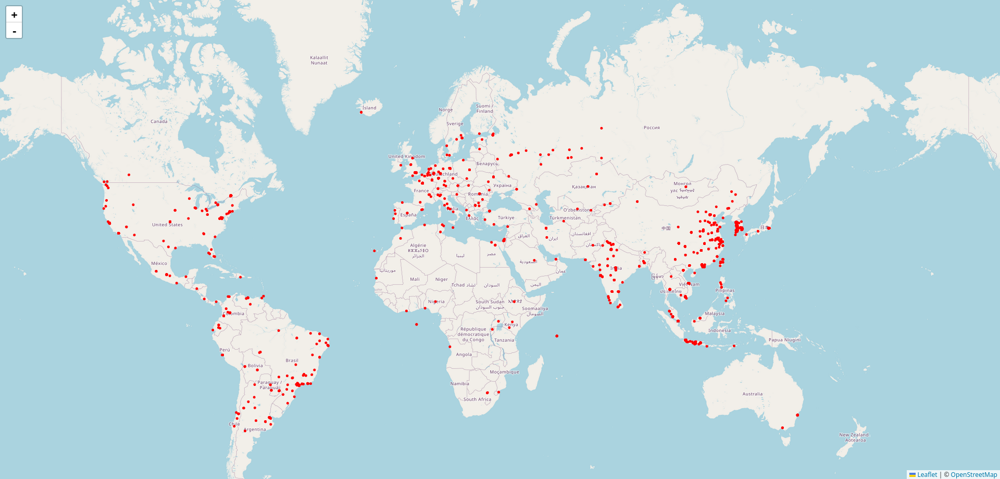

# Geomap

Pipe a list of IP addresses into the binary to plot them on top of a map:

```bash
curl -s 'https://lists.blocklist.de/lists/ssh.txt' | ./bin/geomap  ~/Downloads/GeoIP2-City.mmdb >/tmp/out.html && sleep 1 && firefox /tmp/out.html
```



You'll need a copy of MaxMind's GeoIP database.


## Credits

You can use this repository you'd like.

As this project uses third-party software, be sure to check their license and
terms of service.

+ https://leafletjs.com/
+ https://www.openstreetmap.org/about
+ https://www.maxmind.com/en/home
+ https://github.com/oschwald/maxminddb-golang
